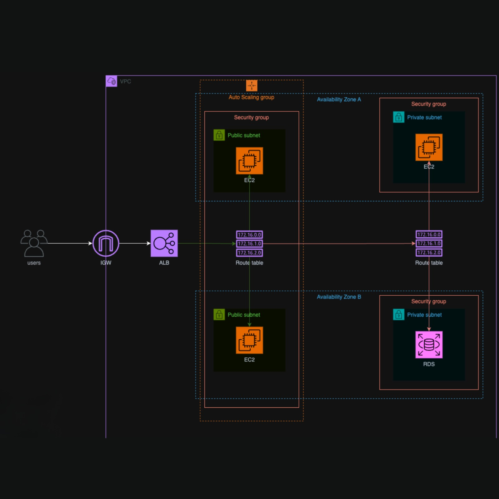

  

# AutoScalable Terraform - Infrastructure as Code (IaC)

AutoScalable Terraform project, an Infrastructure as Code (IaC) implementation to create a fully autoscalable application in the cloud. This project uses Terraform and provisions essential resources including EC2, ALB, ASG, Security Group, RDS, VPC, subnets, Internet Gateway and routing tables.

## 🖥️ Project Preview

## 🚀 Provisioned Resources

- **EC2 (Virtual Machines):**
  - EC2 instances to host the application.

- **ALB (Application Load Balancer):**
  - Load balancer to distribute traffic among EC2 instances.

- **ASG (Auto Scaling Group):**
  - Group to manage the automatic scaling of the application.

- **Security Group:**
  - Configuration of security rules to control inbound/outbound traffic.

- **RDS (Relational Database Service):**
  - Relational database to store application data.

- **VPC (Virtual Private Cloud):**
  - Isolated virtual network to host AWS resources.

- **Subnets:**
  - VPC subdivisions for organization and resource isolation.

- **Internet Gateway:**
  - Entry/exit point for traffic between VPC and the Internet.

- **Routing Table:**
  - Route configuration to direct traffic within the VPC.

## 💻 How to Use

1. **Prerequisites:**
   - Install Terraform on your machine.

2. **Configuration:**
   - Configure your AWS credentials.
   - Adjust variables in the `variables.tf` file as needed.
   - If you have multiple AWS profiles and need to use a specific profile, ensure your AWS CLI is configured appropriately. You can set the AWS profile by exporting the `AWS_PROFILE` environment variable or specifying the `profile` attribute in the provider block in your Terraform configuration.

3. **Provisioning:**
   - Run `terraform init` to initialize the project.
   - Run `terraform apply` to create resources in AWS.

4. **Notes:**
   - Ensure to review and understand the provisioned resources.
   - Make changes to the Terraform code as necessary.

